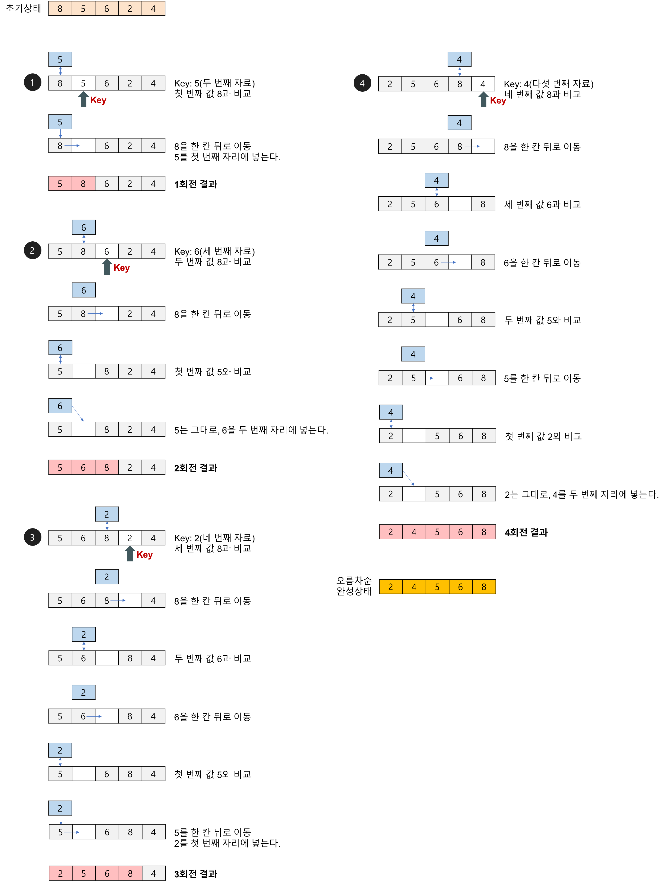
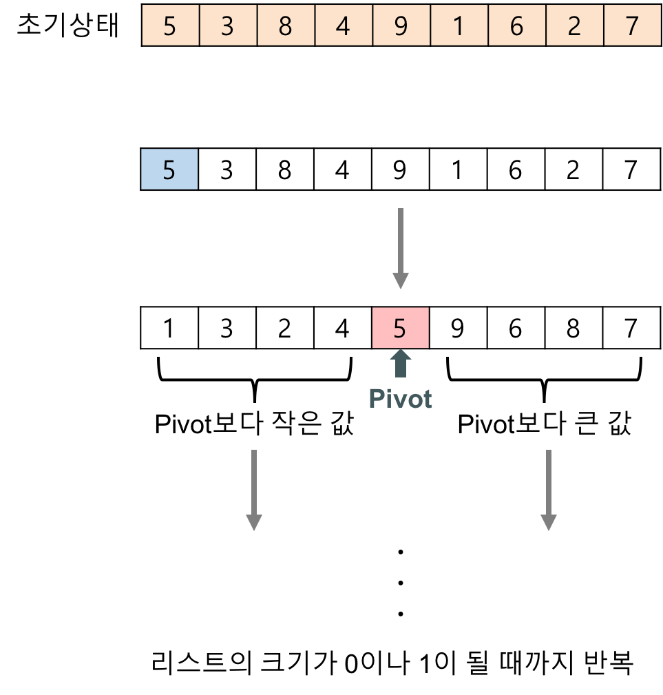

# 정렬
```
데이터를 특정한 기준에 따라서 순서대로 나열하는 것
```

## 선택정렬

[](https://gmlwjd9405.github.io/)

* 정렬이 안된 수열 중 가장 작은 수를 선택하여, 맨 앞으로 보내는 정렬.

## 삽입정렬

[](https://gmlwjd9405.github.io/)

* 수열의 2번째부터 선택을 시작하여, 자신의 앞(정렬 된) 수열중 자신의 위치를 찾아가는 방식의 정렬.

## 거품정렬

[](https://gmlwjd9405.github.io/)

* 자신과 뒤의 숫자를 선택하여, 비교후 앞, 뒤로 나누는 정렬

## 퀵정렬

[](https://gmlwjd9405.github.io/)

* 기준(=피벗)을 정하여, 그것보다 큰것과 작은것을 구분하는 방식의 정렬
* 가장 많이 사용되는 정렬 알고리즘이며, 피벗을 어떻게 정하는가에 따라서 정렬 속도가 달라진다.

## 계수정렬

* 수열의 최대값 만큼의 배열을 만들어, 해당 인덱스에 개수를 카운팅하여 정렬하는 방식의 정렬
* 특정한 조건이 부합할 때 사용해볼 수 있는 정렬 알고리즘
* 가장 큰 데이터와 가장 작은 데이터의 차이가 1,000,000 이하일 때 사용하기 용이

## 문제풀이
### 위에서 아래로
```Swift
/// 삽입정렬 사용
func upToDown(_ arr: [Int]) -> [Int] {
    var arr = arr
    
    for i in 1 ..< arr.count {
        for j in (0 ..< i).reversed() {
            if arr[j] < arr[i] {
                arr.swapAt(i, j)
            }
        }
    }
    
    return arr
}
```
### 성적이 낮은 순서로 학생 출력하기
```Swift
/// 계수 정렬 사용
func grade(_ arr: [String]) -> [String] {
    /// 이름, 성적을 나눈 튜플 만들기
    var students = [(name: String, grade: Int)]()
    
    arr.forEach {
        let name = String($0.split(separator: " ")[0])
        let grade = Int($0.split(separator: " ")[1])!
        students.append((name, grade))
    }
    
    /// 계수정렬용 배열 만들기
    let max = students.max(by: { $0.grade < $1.grade })!.grade
    var list = [[(name: String, grade: Int)]](repeating: [], count: max + 1) // 배열은 0부터 시작하므로, +1을 해줌
    
    /// 계수 정렬 시작
    students.forEach {
        list[$0.grade].append($0)
    }
    
    // 순서대로 담기
    students.removeAll()
    
    list.forEach {
        if $0.count > 0 {
            $0.forEach { student in
                students.append(student)
            }
        }
    }
    
    return students.map { $0.name }
}
```
### 두 배열의 원소 교체

```Swift
func selectionSort(_ arr: [Int]) -> [Int] {
    var arr = arr
    
    for i in 0 ..< arr.count {
        var min = arr.max()! + 1
        var minIndex = -1
        
        for j in i ..< arr.count {
            if arr[j] < min {
                min = arr[j]
                minIndex = j
            }
        }
        
        arr.swapAt(i, minIndex)
    }
    
    return arr
}

func listSwap(_ arr1: [Int], _ arr2: [Int], _ k: Int) -> Int {
    var arr1 = arr1
    var arr2 = arr2
    
    /// 선택정렬로 두 배열을 정렬
    /// arr1은 오름차순
    /// arr2는 내림차순
    
    arr1 = selectionSort(arr1)
    arr2 = selectionSort(arr2)
    arr2.reverse() /// 귀찮아서 오름차순 정렬하고 리버스
    
    for i in 0 ..< k {
        let tmp = arr1[i]
        arr1[i] = arr2[i]
        arr2[i] = tmp
    }
    
    
    return arr1.reduce(0, +)
}
```

## 프로그래머스
### 가장 큰 수
```Swift
func solution(_ numbers:[Int]) -> String {
    let result = numbers.reduce(0) { $0 + $1 }
    if result == 0 { return "0" }
    var strings = numbers.map { String($0) }
    
    strings.sort { $0 + $1 > $1 + $0 }
    
    return strings.joined()
}
```

### H-Index
```Swift
func solution(_ citations:[Int]) -> Int {
    let count = citations.count + 1
    
    for i in (0 ..< count).reversed() {
        if citations.filter({ $0 >= i }).count >= i {
            return i
        }
    }
    
    return 0
}
```