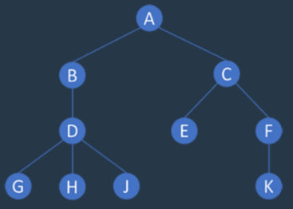
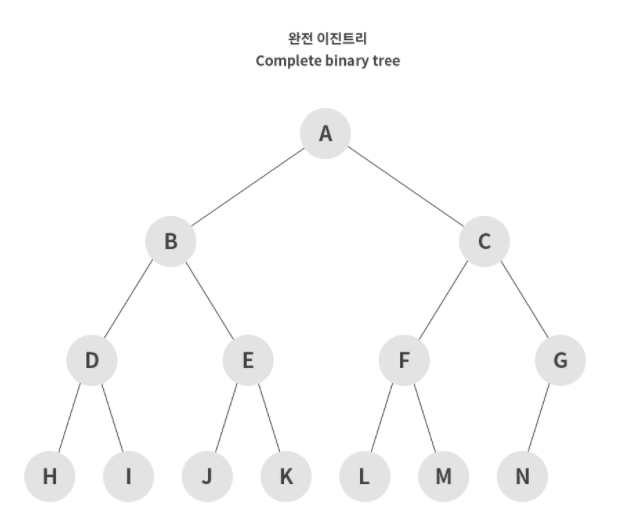

# Binary Search (이진 탐색)

## 순차 탐색

리스트의 앞에서부터 하나씩 데이터를 확인해가는 탐색

## 이진 탐색

리스트의 중간을 찾아서 나눠가는 방식으로 찾아나가는 탐색.

한번 탐색이 될때마다 리스트의 절반씩 좁혀가므로, 속도가 매우 빠르다.


## 트리

노드(데이터)를 선으로 연결하여 추상화한 자료구조.

데이터의 저장보다는, 효율적인 탐색을 위해 고안되었음.

따라서 리스트와의 차이점은 단순하게 나열된 구조가 아닌, 부모(Parent)와 자식(Child)이라는 계층적 관계로 표현. 



## 이진 트리

자식 노드가 최대 2개인 트리형태의 자료구조.

노드가 채워진 형태에 따라서 `완전 이진트리, 전 이진트리, 포화 이진트리` 등의 수식어가 붙음.




## 문제풀이
### 부품 찾기
```Swift
extension Array where Element == Int {
    func binarySearch(_ value: Int) -> Bool {
        var start = 0
        var end = self.count - 1
        
        while start <= end {
            let point = (start + end) / 2
            let target = self[point]
            if target == value { return true }
            else if target > value { end = point - 1 }
            else { start = point + 1 }
        }
        
        return false
    }
}

func solution(_ myList: [Int], _ orderList: [Int]) -> [Bool] {
    // 내 부품들 정렬
    let myList = myList.sorted()
    
    var results = [Bool]()
    
    // 오더 목록대로 반복하여 이진탐색을 함.
    for item in orderList {
        results.append(myList.binarySearch(item))
    }
    
    return results
}
```
### 떡볶이 떡 만들기
```Swift
func solution(_ length: Int, _ items: [Int]) -> Int {
    guard var end = items.max() else { return -1 }
    var start = 0
    
    var result = 0
    
    while start <= end {
        let point = (start + end) / 2
        
        let total = items
            .filter({ $0 > point })
            .reduce(0) { $0 + ($1 - point) }
        
        if total < length { end = point - 1 }
        else {
            result = point
            start = point + 1
        }
    }
    
    return result
}
```
